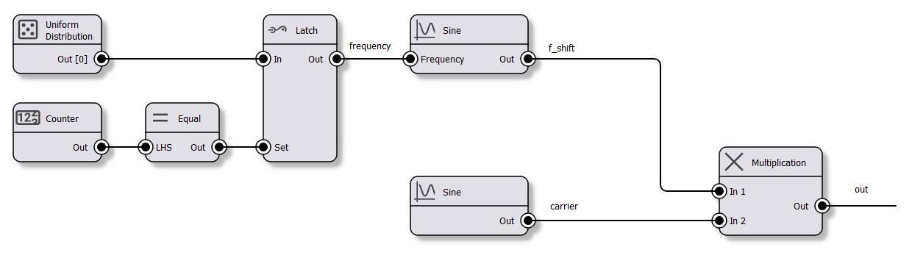
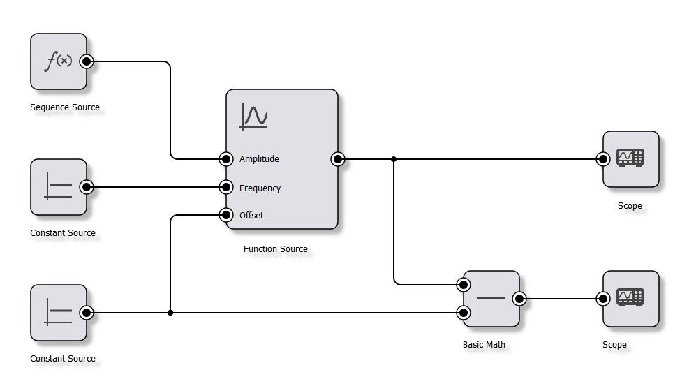

# Packages
[](https://repology.org/project/qschematic/versions)

# Introduction
QSchematic is a library to draw diagrams & schematics with Qt. It uses Qt's [graphics view framework](http://doc.qt.io/qt-5/graphicsview.html).

The library provides base classes for objects such as nodes and wires and implements logic to move objects around while keeping the wires connected, generating netlists and so on. A typical application would include this library and subclass the `Item` class to implement custom items.

Feature overview:
  - Add, remove, move, resize nodes
  - Connect nodes with wires
  - Undo/redo
  - Drag'n'Drop
  - Template based netlist generation
  - Serialization to/from XML
  - Completely customizable by inheriting from the provided classes
  - Items
    - All items support "highlighted" and an optional pop-up widget on hover
    - Nodes
    - Wires
      - Straight
      - Square
      - Spline / Bezier
    - Connectors
    - Widgets (embed any `QWidget` into the scene)

Technical stuff:
  - Written in C++17
  - Works with Qt5 and Qt6
  - Everything is contained within the `QSchematic` namespace
  - MIT licensed

# Licensing
This library is MIT licensed.

# Credits
This library was originally designed, implemented and maintained by [Joel Bodenmann](https://github.com/tectu) in 2015. It was handed over to [Simulton GmbH](https://simulton.com) in late 2018. 

Special thank goes to Professor François Corthay (Switzerland) for initially privately funding this project.

# Screenshots
The library allows complete customization of every visual aspect. Therefore, screenshots are not really a telling thing as they are just showing an application specific implementation of the paint functions. But meh... I guess people still want to see some stuff so here we go:



For more, check out the `docs/screenshots` folder.

# Instructions
This is built using `cmake`.

## Building
The following targets are provided:

| Target | Description |
| --- | --- |
| `qschematic-static` | Builds a static library. | 
| `qschematic-shared` | Builds a shared/dynamic library. | 
| `qschematic-demo` | Builds a simple demo application. | 

Dependencies:
  - Qt5 (>= 5.15) or Qt6
  - [GPDS](https://gpds.simulton.com) for (de)serialization.

If the cmake option `QSCHEMATIC_DEPENDENCY_GPDS_DOWNLOAD` is enabled (default), cmake will automatically pull the `GPDS` dependency.
Therefore, assuming a system with a working Qt5 or Qt6 installation, all you have to do is:

```shell
git clone https://github.com/simulton/qschematic
cd qschematic
cmake -B build
cmake --build build
```

## Integration

### CMake
This library can be integrated easily into other cmake projects. There are two main mechanisms available:
- Using `FetchContent_Declare()`
- Install the library and use `find_package()`

#### fetchContent_Declare()
```cmake
include(FetchContent)

# Fetch QSchematic
FetchContent_Declare(
    qschematic
    GIT_REPOSITORY https://github.com/simulton/qschematic
    GIT_TAG        master
)
FetchContent_MakeAvailable(qschematic)

# Link to your application/library
target_link_libraries(
    my_app
    PRIVATE
        qschematic-static
)
```
Note that any serious consumer might want to specify an actual git tag or a commit hash via `GIT_TAG` rather than a branch name.
To change options & variables, the call to `FetchContent_MakeAvailable()` shown above can be replaced with:
```cmake
FetchContent_Declare(
    qschematic
    GIT_REPOSITORY https://github.com/simulton/qschematic
    GIT_TAG        master
)
FetchContent_GetProperties(qschematic)
if(NOT qschematic_POPULATED)
    FetchContent_Populate(qschematic)
    
    set(QSCHEMATIC_BUILD_DEMO OFF CACHE INTERNAL "")
    set(QSCHEMATIC_DEPENDENCY_GPDS_DOWNLOAD OFF CACHE INTERNAL "")
    set(QSCHEMATIC_DEPENDENCY_GPDS_TARGET "gpds-shared" CACHE INTERNAL "")
    
    add_subdirectory(${qschematic_SOURCE_DIR} ${qschematic_BINARY_DIR})
endif()
```

#### find_package()
The QSchematic static & shared library cmake targets are exported which allows for easy integration into a client application/library.
After successfully building & installing the QSchematic library targets, use `find_package()` to include the QSchematic targets and `target_link_libraries()` to add the corresponding target to your client application/library:
```
find_package(QSchematic REQUIRED)

add_executable(my_application "")
target_link_libraries(my_application qschematic::qschematic-static)
```

### Other build systems
Use the cmake scripts that ship with this library to build either the static library (cmake target `qschematic-static`) or the shared library (cmake target `qschematic-shared`) and link the resulting library into your client application/library using whatever mechanism the build system of your choosing provides.

# Architecture
Did someone say UML?!

The class diagramm below shows the overall architecture of the system:


All items that are part of the `Scene` inherit from the `Item` class. There are built-in specialized classes for nodes, wires and so on:

